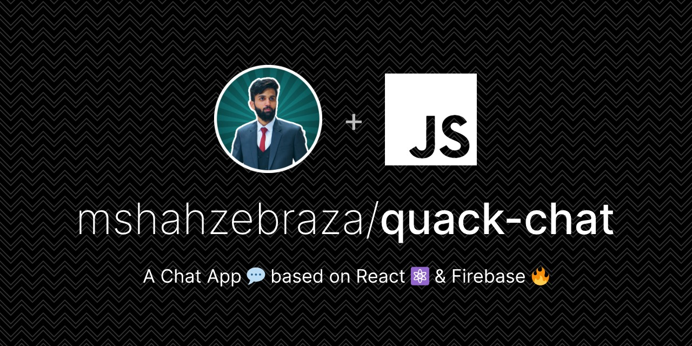

# Quack-Chat 🐤💬

A Chat App 💬 based on React ⚛ & Firebase 🔥.
User can create an account, search for another user and start chatting with him directly (in realtime).

> New users can search for **shahzeb** in the search to start chat

 

## Features

- 🎯 Image Upload & Storage supported 📷
- 🎯 Email & password authentication ✅
- 🎯 Realtime messaging 🚀
- 🎯 In-Chat image preview 💻
- 🎯 State Persistance 🔁

## Tech Used/ Dependencies

       
<!--  !--   -->
- **React** (JavaScript Framework) is used for frontend of the App
- **Firebase** is used for backend services like authentication, image-storage, realtime-database
- **Client-side state management** is done using `useState` and `jotai`
- **Routing & Navigation** is supported with `react-router`
- **Styling** is done through custom `sass` styles
- **Bundling** is made possible with `vite`
- **Version Control** Github
- **Hosting** is live at Netlify

## About the Creator

The project was created by **M.Shahzeb Raza**. You can **get-in-touch** with him by clicking one of the following buttons.

    

## To Do

- [ ] Add a favicon
- [ ] Scroll to latest messages
- [ ] Scroll bar in Chat Window
- [ ] Mobile Responsiveness
- [ ] Loader
- [ ] Component Level Code Splitting
- [ ] Error Boundaries
- [ ] Fallback Images/Avatar
- [ ] About & Landing Pages
- [ ] Footer with credits and social links
- [ ] Logout Icon
